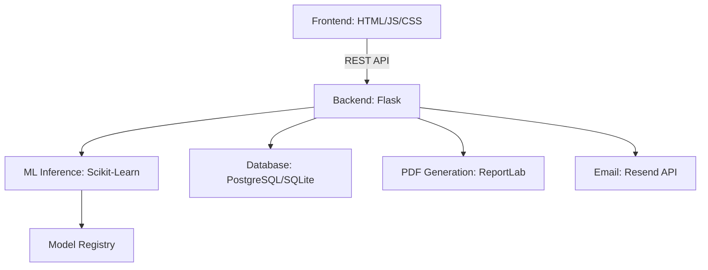

# Smart Health Sync
**AI-Powered Clinical Decision Support Platform**

> A clinical decision support web application combining a supervised machine learning classifier trained on 24 standardized blood biomarkers with a structured, symptom-first clinical workflow: Patient Case → Symptoms → Preliminary Assessment → Investigations → Lab Results → Prediction & Report.

---

## Overview

Smart Health Sync is a final-year Computer Science research project at the **University of Ghana** (2026). It supports doctors through a full, staged diagnostic case workflow rather than a single one-shot prediction: capturing presenting symptoms, generating an AI-assisted preliminary assessment, recommending and recording relevant lab investigations, running a biomarker-based ML prediction once results are in, and producing a signed, sectioned PDF clinical report.

---

## Architecture



## Project Structure

```text
smarthealth/
├── backend/
│   ├── api/                # Blueprints: auth, clinical routes, views, PDF builder
│   ├── database/           # SQLAlchemy models, seeding, symptom vocabulary
│   ├── ml/                 # Training, inference, preprocessing, registry
│   ├── config.py           # Multi-env config
│   └── factory.py          # App factory + schema auto-migration
├── frontend/
│   ├── static/             # CSS/JS/images
│   └── templates/          # Jinja2 templates
├── models/                 # Trained model registry (kept in sync by train.py)
├── data/                   # Clinical biomarker dataset (train/test CSVs)
├── notebooks/              # Exploratory ML analysis (mirrors train.py's methodology)
├── scripts/                # One-off maintenance scripts (e.g. symptom vocabulary import)
├── reports/                # Data-quality audit documentation
├── docker/                 # Containerized deployment
├── .github/                # CI/CD workflows
├── main.py                 # Production entry point
└── README.md
```

## Clinical Workflow

The core of the application is a six-stage case workflow, not a single prediction call:

1. **Patient Case** — select an existing patient or start a standalone case; a case reference is generated automatically.
2. **Symptoms** — capture presenting symptoms via a searchable vocabulary (~390 terms) or free text.
3. **Preliminary Assessment** — a structured, rule-based candidate summary generated from the recorded symptoms, clearly marked as not a diagnosis.
4. **Investigations** — recommended lab tests based on the preliminary assessment; the doctor selects which to order.
5. **Lab Results** — enter results for selected investigations in their normal clinical units (e.g. mg/dL, g/dL, mmHg) — the system converts these internally for the model.
6. **Prediction & Report** — runs the trained classifier on the recorded biomarkers, then generates a sectioned, doctor-signed PDF report.

## Database Schema (SQLAlchemy)

- **Users** — authentication and RBAC (Admin / Doctor / Technician / Patient)
- **Patients** — patient profiles, optionally linked to a login account
- **DiagnosticRecords** — one per clinical case, snapshotting biomarkers, predictions, and final review data
- **PatientCaseSymptom / PreliminaryAssessment / CaseInvestigation / InvestigationResult / ModelPrediction / AISummary / GeneratedReport** — the per-stage clinical workflow tables
- **SymptomCatalog / InvestigationCatalog / InvestigationRule** — reference/decision-support catalogs

Schema changes are applied automatically on startup for both SQLite (local dev) and PostgreSQL (production) — see `backend/factory.py`.

## ML Models

| Model | Test Accuracy | Test F1-Score | CV Mean | Status |
| :--- | :--- | :--- | :--- | :--- |
| **Decision Tree** ⭐️ | **76.6%** | **0.7704** | 62.1% | **Active Best** |
| **Random Forest** | 73.0% | 0.6941 | 64.6% | Valid |
| **SVM (RBF Kernel)** | 65.8% | 0.6325 | 63.0% | Valid |
| **Logistic Regression** | 55.9% | 0.5808 | 45.0% | Baseline |

### Training details:
- 24 biomarkers (metabolic, cardiovascular, hematological, hepatic/renal)
- 440 training samples / 111 test samples, strictly independent files (no shared or duplicated rows — verified leakage-free)
- Stratified 5-fold cross-validation, `class_weight='balanced'` for class imbalance
- `StandardScaler` fit on training data only

**Known limitation:** the source biomarker dataset ships pre-normalized to a 0–1 scale with the original normalization bounds not published. The app approximates real-world clinical reference ranges (see `backend/ml/preprocessing/normalization.py`) to convert a doctor's raw lab-unit input into a comparable scale before inference. This is documented, reasonable, and the best available approach given the data source — but it means absolute accuracy in production may differ slightly from the benchmark numbers above, which were measured directly against the dataset's native scale.

**Retraining:** `python backend/ml/training/train.py` (writes to both `models/` and `backend/ml/registry/models/`, and updates `metadata.json` / `results_summary.json`). `notebooks/SmartHealth_AI_Analysis.ipynb` is for exploratory analysis only and never writes to the production model folders.

## API Reference

### Auth (`/api/auth`)
| Endpoint | Method | Description |
| :--- | :--- | :--- |
| `/register` | POST | Register a patient account |
| `/register-doctor` | POST | Register a doctor account (with proof document) |
| `/login` | POST | Authenticate and start a session |
| `/logout` | GET/POST | End session |
| `/reupload-proof` | POST | Doctor re-submits verification document |
| `/admin/doctors/<id>/proof` | GET | Admin: view/download a doctor's proof document |

### Clinical Workflow (`/api`)
| Endpoint | Method | Description |
| :--- | :--- | :--- |
| `/cases` | POST | Start a new clinical case |
| `/cases/<id>` | GET | Fetch a case (for resuming an in-progress workflow) |
| `/cases/<id>/symptoms` | POST | Record presenting symptoms |
| `/cases/<id>/pre-assessment` | POST | Generate preliminary assessment |
| `/cases/<id>/investigation-recommendations` | GET | Suggested investigations |
| `/cases/<id>/investigations` | POST | Select investigations to order |
| `/cases/<id>/investigations/<inv_id>/status` | POST | Update an investigation's status |
| `/cases/<id>/investigations/<inv_id>/results` | POST | Enter lab results |
| `/cases/<id>/predictions` | POST | Run the ML prediction on recorded biomarkers |
| `/cases/<id>/ai-summary` | POST | Generate a structured clinical narrative |
| `/cases/<id>/reports` | POST | Generate the final PDF report |
| `/cases/<id>/reports/<report_uuid>/download` | GET | Download the generated PDF |
| `/symptoms` | GET | Search the symptom vocabulary |

### History & Legacy Predict
| Endpoint | Method | Description |
| :--- | :--- | :--- |
| `/history` | GET | List a doctor's/admin's diagnostic records |
| `/history/<id>/approve` | POST | Finalize a case's diagnosis (requires recorded biomarkers) |
| `/predict` | POST | Legacy one-shot prediction (bypasses the case workflow) |
| `/models` | GET | Available classifiers & expected features |

### Admin
| Endpoint | Method | Description |
| :--- | :--- | :--- |
| `/admin/doctors` | GET | List doctor accounts and verification status |
| `/admin/doctors/<id>/verify` | POST | Approve/reject a doctor |
| `/admin/doctors/<id>/toggle-status` | POST | Activate/deactivate a doctor |
| `/admin/doctors/<id>` | DELETE | Permanently delete a doctor (only if no case history) |

### System
| Endpoint | Method | Description |
| :--- | :--- | :--- |
| `/health` | GET | System health check |
| `/health/models` | GET | ML model validation status |
| `/notifications` | GET | Paginated notification feed |

---

## Quick Start

### Prerequisites
- Python 3.11+
- pip

### Local Development
```bash
git clone https://github.com/heisqueenson9/SmartHealth.git
cd SmartHealth

python -m venv venv
venv\Scripts\activate   # Windows
source venv/bin/activate # macOS/Linux

pip install -r requirements.txt
python main.py
# → http://localhost:5000
```

### With Docker
```bash
docker-compose up --build
# → http://localhost:5000
```

## Deployment (Render.com)

1. Connect your GitHub repository to Render.
2. Render auto-detects `render.yaml`.
3. Ensure `models/` is committed (see `.gitignore` for exclusions).
4. In the Render dashboard, manually set:
   - `RESEND_API_KEY` — for doctor approval/status emails (not auto-set by `render.yaml`)
   - `MAIL_DEFAULT_SENDER` — an address on a domain you've verified in Resend (the sandbox `onboarding@resend.dev` address can only email your own Resend account, not real users)

## Environment Variables

| Variable | Default | Description |
| :--- | :--- | :--- |
| `FLASK_ENV` | `development` | `production` in deployment |
| `SECRET_KEY` | auto-generated | Flask session secret |
| `DATABASE_URL` | — | PostgreSQL connection string (Render-provided) |
| `PORT` | `5000` | HTTP port |
| `LOG_LEVEL` | `INFO` | Python logging level |
| `RESEND_API_KEY` | — | Enables doctor status emails |
| `MAIL_DEFAULT_SENDER` | Resend sandbox | Verified sender address |
| `GROQ_API_KEY` | — | Optional, for AI-assisted features |

*Note on file uploads:* Render's web service disk is ephemeral — files written to disk don't survive a redeploy. Doctor verification documents are stored directly in the database (not on disk) specifically to survive this; see `backend/api/auth.py`.

## Testing

```bash
pytest backend/tests/ -v
pytest backend/tests/ --cov=backend --cov-report=term-missing
```

## Security

- Blueprint-wide exception handling with automatic DB rollback on failure
- Session-based RBAC (Admin / Doctor / Technician / Patient)
- Doctor accounts require admin approval before clinical access
- CORS restricted to configured origins
- No stack traces exposed in production responses

## Disclaimer

**Academic Research Prototype.** This system is not an FDA-cleared medical device and must not be used for unsupervised clinical decision-making. All diagnostic outputs must be reviewed by a qualified healthcare professional. Predicted diagnoses are algorithmic inferences, not final clinical diagnoses.

---

## Authors

**Enock Queenson Eduafo** Student ID: 11014444 BSc Information Technology — University of Ghana (2026) Supervisor: Professor Solomon Mensah

**Christabel Araba Edumadze** Student ID: 11348914 BSc Information Technology — University of Ghana (2026) Supervisor: Professor Solomon Mensah

© 2026 Enock Queenson Eduafo & Christabel Araba Edumadze — Smart Health Sync. All rights reserved.
