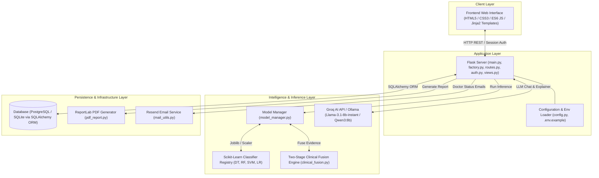
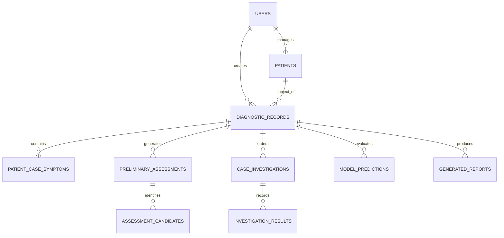

# Smart Health Sync
**AI-Powered Clinical Decision Support & Diagnostic Workflow Platform**

> A comprehensive, staged clinical decision support platform combining a supervised machine learning classifier trained on 24 blood biomarkers with a 6-stage clinical case workflow: Patient Case → Symptoms → Preliminary Assessment → Investigations → Lab Results → ML Prediction & Signed Report.

---

## 1. Explain It Like I'm 10 🎈

Imagine when you feel sick and visit a doctor. A good doctor doesn't just guess what's wrong! First, they listen to what hurts (**symptoms** like a fever or headache). Next, they figure out which blood tests you need (**investigations**). Then, they send you to a lab to measure your blood numbers (**lab results**). Finally, they look at all the test numbers together to identify the exact illness (**diagnosis**) and tell you how to get better (**treatment**).

**Smart Health Sync** is like a super-smart digital assistant for doctors. It guides doctors step-by-step through every part of that hospital visit. It uses artificial intelligence to compare a patient's blood test numbers against patterns from hundreds of previous health records to help doctors catch diseases like Diabetes, Anemia, or Heart Disease faster and more accurately—and it even prints out a neat, official medical report!

---

## 2. Project Overview

**Smart Health Sync** is a full-stack web application and final-year Computer Science research project developed at the **University of Ghana** (2026) under the academic supervision of **Professor Solomon Mensah**. 

Unlike standard "one-shot" prediction APIs, Smart Health Sync models real-world healthcare delivery. It provides a structured, staged clinical case management system that pairs presenting symptoms with 24 standardized blood biomarkers across metabolic, hematological, cardiovascular, hepatic, and renal physiological systems. The platform integrates machine learning classifiers, two-stage clinical evidence fusion, Groq LLM explanation services, and automated PDF report generation to empower medical practitioners while upholding rigorous clinical protocols.

---

## 3. Who Uses It (User Roles & Permissions)

The application implements granular Role-Based Access Control (RBAC) with four distinct user roles:

| Role | Access Level & Key Capabilities |
| :--- | :--- |
| **Super Administrator (`admin`)** | • Accesses dedicated admin login portal (`/system-access-portal` or `/admin`).<br>• Verifies, approves, or rejects newly registered doctor credentials (`/verify`, `/admin/doctors/<id>/verify`).<br>• Downloads uploaded proof of professionalism documents (`/admin/doctors/<id>/proof`).<br>• Toggles doctor active status or deletes unlinked doctor accounts (`/admin/doctors/<id>`).<br>• Manages training datasets: lists, uploads custom CSV datasets, and deletes datasets (`/admin/datasets`).<br>• Monitors system health and triggers ML model retraining (`/admin/model/retrain`).<br>• Views system-wide diagnostic records across all practitioners. |
| **Doctor / Practitioner (`doctor`)** | • Registers with medical license numbers and proof file uploads (`/register`). Requires admin approval before clinical features unlock. Can re-submit credentials (`/reupload`).<br>• Creates and updates patient profiles (`/patients`), and archives resolved patient cases.<br>• Executes full 6-stage clinical case workflows: records symptoms, generates pre-assessments, orders lab tests, inputs results, runs ML biomarker predictions, and asks AI assistant questions.<br>• Signs off diagnostic drafts and generates downloadable PDF clinical reports.<br>• Receives in-app notifications and manages connected lab technicians. |
| **Lab Technician (`technician`)** | • Requests connection with verified doctors (`/technician/connect`).<br>• Directly inputs and submits lab investigation biomarker test results for patient cases assigned to connected doctors (`/technician/submit-biomarkers`). |
| **Patient (`patient`)** | • Patient user account linked to a patient profile record.<br>• Logs in (`/login`) to view finalized, doctor-approved medical reports (`/history/<id>`).<br>• Interacts with the Groq AI explanation assistant (`/history/<id>/explain`) to ask questions about their diagnosis in simple language. |

---

## 4. The Core Workflow (Step-by-Step)

The application enforces a staged 6-step case workflow:

1. **Step 1: Patient Case Creation** — Doctor selects an existing patient profile or initiates a new case session (`POST /cases`), generating an automated case reference code (e.g., `SHS-GEN-XXXXXX` or `SHS-IN-XXXXXX`).
2. **Step 2: Symptom Capture** — Doctor records presenting symptoms using a searchable vocabulary of **560 cataloged symptoms** or free-text inputs, specifying severity (*Mild*, *Moderate*, *Severe*) and duration (`POST /cases/<id>/symptoms`).
3. **Step 3: Preliminary Assessment** — Rule-based reasoning engine analyzes reported symptoms to generate candidate conditions with clinical rationales, clearly marked as preliminary considerations rather than final diagnoses (`POST /cases/<id>/pre-assessment`).
4. **Step 4: Investigation Selection** — Based on preliminary candidate conditions, the system recommends targeted laboratory test panels (e.g., Full Blood Count, Lipid Profile, Glucose/HbA1c). Doctor selects which tests to order (`POST /cases/<id>/investigations`).
5. **Step 5: Lab Results Entry** — Doctor or connected lab technician enters actual biomarker values in standard clinical units (e.g., Fasting Glucose in mg/dL, Hemoglobin in g/dL, Platelets in x10^3/uL) (`POST /cases/<id>/investigations/<inv_id>/results`).
6. **Step 6: AI Inference, Fusion & Signed Report** — The ML engine normalizes biomarkers and runs inference across 6 target classes. A two-stage evidence fusion algorithm merges symptom evidence with biomarker probabilities. The doctor reviews AI narratives, interacts with the Q&A assistant, adds clinical observations, signs the record, and downloads a sectioned PDF report (`POST /cases/<id>/reports`).

---

## 5. Key Features

- 🏥 **Staged 6-Step Clinical Case Management**: Prevents premature diagnosis by requiring symptom intake and lab investigation selection prior to ML inference.
- 🔬 **AI-Powered 6-Class Disease Prediction**: Supervised machine learning algorithms classifying *Anemia*, *Diabetes*, *Healthy*, *Heart Disease*, *Thalassemia*, and *Thrombocytopenia*.
- 🧬 **Two-Stage Clinical Evidence Fusion**: Combines Stage A symptom evidence with Stage B biomarker predictions to output unified confidence scores, supporting indicators, and conflicting evidence warnings.
- 💬 **Groq LLM AI Assistant & Explainer**: Conversational Q&A powered by Groq's `llama-3.1-8b-instant` (with fallback to local Ollama `qwen3:8b` or graceful degradation messages when unconfigured).
- 📚 **Standardized 560-Symptom Vocabulary**: Comprehensive medical symptom catalog supporting fuzzy search, category filtering, and synonym resolution.
- 🧪 **Targeted Investigation Rules Engine**: Maps candidate conditions to specific clinical panels (Full Blood Count, Lipid Profile, Cardiac Markers, Liver/Renal Function, Glycemic Panel).
- 🔐 **Doctor Verification Gatekeeper**: Multi-factor onboarding requiring license numbers and proof file uploads (stored in DB binary format to survive ephemeral cloud disk redeploys).
- 📄 **Dynamic ReportLab PDF Generation**: Generates official, sectioned PDF diagnostic reports featuring doctor signatures, patient details, biomarker tables, and clinical recommendations.
- 🔄 **Multi-Database Support & Auto Schema Migration**: Transparently supports SQLite for local dev and PostgreSQL for production with auto schema synchronization on startup.

---

## 6. System Architecture


```mermaid
graph TD
    subgraph Client Layer
        WebUI["Frontend Web Interface (HTML5 / CSS3 / ES6 JS / Jinja2 Templates)"]
    end

    subgraph Application Layer
        FlaskServer["Flask Server (main.py, factory.py, routes.py, auth.py, views.py)"]
        Config["Configuration & Env Loader (config.py, .env.example)"]
    end

    subgraph Intelligence & Inference Layer
        ModelMgr["Model Manager (model_manager.py)"]
        MLRegistry["Scikit-Learn Classifier Registry (DT, RF, SVM, LR)"]
        FusionEngine["Two-Stage Clinical Fusion Engine (clinical_fusion.py)"]
        LLMService["Groq AI API / Ollama (Llama-3.1-8b-instant / Qwen3:8b)"]
    end

    subgraph Persistence & Infrastructure Layer
        Database[("Database (PostgreSQL / SQLite via SQLAlchemy ORM)")]
        PDFEngine["ReportLab PDF Generator (pdf_report.py)"]
        MailService["Resend Email Service (mail_utils.py)"]
    end

    WebUI <-->|HTTP REST / Session Auth| FlaskServer
    FlaskServer --- Config
    FlaskServer <-->|SQLAlchemy ORM| Database
    FlaskServer -->|Run Inference| ModelMgr
    ModelMgr <-->|Joblib / Scaler| MLRegistry
    ModelMgr <-->|Fuse Evidence| FusionEngine
    FlaskServer <-->|LLM Chat & Explainer| LLMService
    FlaskServer -->|Generate Report| PDFEngine
    FlaskServer -->|Doctor Status Emails| MailService
```

---

## 7. Project Structure

```text
SmartHealth/
├── .github/
│   └── workflows/
│       ├── ci.yml                     # GitHub Actions CI running pytest on push/PR to main and develop
│       └── keep_alive.yml             # Scheduled cron pinging /api/health every 12 mins to keep Render service warm
├── api/
│   └── index.py                       # Vercel serverless deployment entry point
├── backend/
│   ├── api/
│   │   ├── __init__.py                # API blueprint package initialization
│   │   ├── auth.py                    # Auth, registration, doctor proof uploads, & session management
│   │   ├── mail_utils.py              # Resend HTTP API integration for doctor status notification emails
│   │   ├── pdf_report.py              # ReportLab engine building downloadable clinical PDF reports
│   │   ├── routes.py                  # Core RESTful API endpoints (cases, predictions, symptoms, admin, AI)
│   │   └── views.py                   # HTML template route handlers & dashboard context builder
│   ├── database/
│   │   ├── __init__.py                # Database package initialization
│   │   ├── models.py                  # SQLAlchemy ORM models (18 tables covering users, cases, logs, etc.)
│   │   ├── seed.py                    # Database seeder populating initial admin & symptom/investigation catalogs
│   │   └── symptom_vocabulary.json    # Standardized vocabulary catalog containing 560 medical symptoms
│   ├── ml/
│   │   ├── __init__.py                # ML module package initialization
│   │   ├── clinical_fusion.py         # Two-stage clinical evidence fusion logic (symptoms + lab values)
│   │   ├── model_manager.py           # Singleton loader, health check, path resolver & inference engine
│   │   ├── evaluation/                # Model evaluation scripts and confusion matrix utilities
│   │   ├── inference/                 # Batch inference and standalone scoring helpers
│   │   ├── preprocessing/
│   │   │   └── normalization.py       # Clinical lab value normalization & reference range mapping
│   │   ├── registry/
│   │   │   └── models/                # Secondary backup model registry directory
│   │   └── training/
│   │       └── train.py               # Model training script for 4 classifiers + scaler + label encoder
│   ├── tests/
│   │   ├── test_api.py                # Pytest suite covering health, auth, prediction, case flow, & email mocks
│   │   └── test_fusion.py             # Unit test suite for clinical fusion engine
│   ├── config.py                      # Centralized configuration class loading environment variables
│   └── factory.py                     # Flask application factory with automated DB schema migrations
├── data/
│   ├── Final_Augmented_dataset_Diseases_and_Symptoms.csv # Raw augmented disease and symptom dataset
│   ├── train_data.csv                 # ML training dataset (440 samples, 24 biomarkers)
│   └── test_data.csv                  # ML test dataset (111 samples, 24 biomarkers)
├── docker/
│   └── Dockerfile                     # Multi-stage Python 3.11-slim Docker container configuration
├── frontend/
│   ├── static/
│   │   ├── css/
│   │   │   ├── animations.css         # UI animation keyframes & transition styles
│   │   │   └── main.css               # Core design system CSS stylesheets
│   │   ├── js/
│   │   │   ├── animations.js          # Interactive frontend animation helpers
│   │   │   ├── main.js                # Core frontend utility scripts & API client wrappers
│   │   │   ├── portal.js              # Doctor & Admin dashboard portal interaction logic
│   │   │   ├── predict.js             # Legacy/direct diagnostic prediction page scripts
│   │   │   └── results.js             # Diagnostic result visualization scripts
│   │   ├── reports/                   # Generated static report storage directory
│   │   └── uploads/                   # Temporary file upload storage directory
│   └── templates/
│       ├── about.html                 # About page template detailing research context
│       ├── admin_login.html           # Dedicated admin login page template
│       ├── base.html                  # Main base layout HTML template
│       ├── index.html                 # Public landing page template
│       ├── login.html                 # User login page template
│       ├── portal.html                # Unified admin and doctor dashboard portal template
│       ├── portal_base.html           # Portal layout base template
│       ├── predict.html               # Diagnostic case workflow UI template
│       ├── register.html              # Registration dispatcher template
│       ├── register_doctor.html       # Doctor registration form template with proof file upload
│       └── results.html               # Diagnostic results view template
├── instance/
│   └── smarthealth.db                 # Local SQLite database instance file
├── models/
│   ├── best_model.pkl                 # Trained classifier binary artifact (labeled best model in metadata)
│   ├── decision_tree.pkl              # Trained Decision Tree classifier binary
│   ├── label_encoder.pkl              # Scikit-learn LabelEncoder for 6 disease target classes
│   ├── logistic_regression.pkl        # Trained Logistic Regression classifier binary
│   ├── metadata.json                  # Active model metadata, metrics, class labels, and feature names
│   ├── random_forest.pkl              # Trained Random Forest classifier binary
│   ├── results_summary.json           # Comprehensive model evaluation summary across all 4 algorithms
│   ├── scaler.pkl                     # Trained StandardScaler object for 24 biomarker features
│   ├── support_vector_machine.pkl     # Trained Support Vector Machine classifier binary
│   └── svm.pkl                        # Duplicate alias binary for Support Vector Machine classifier
├── notebooks/
│   └── SmartHealth_AI_Analysis.ipynb  # Jupyter notebook for exploratory data analysis and model prototyping
├── reports/
│   └── symptom_dataset_audit.md       # Audit documentation on symptom vocabulary and data quality
├── scripts/
│   ├── extract_symptom_vocabulary.py  # Utility script to extract and structure symptom vocabulary JSON
│   └── keep_alive_ping.py             # Python script for keep-alive health pinging
├── .env.example                       # Example environment variables template
├── .python-version                    # Python version pin (3.11.9)
├── docker-compose.yml                 # Multi-container Docker Compose configuration
├── main.py                            # Application entry point script for production (Gunicorn) and local execution
├── Procfile                           # Heroku / Render process file (Gunicorn command specification)
├── README.md                          # Project documentation README file
├── render.yaml                        # Render.com Infrastructure-as-Code deployment blueprint
├── requirements.txt                   # Production Python package dependencies with strict version pins
└── runtime.txt                        # Python runtime specification (python-3.11.9)
```

---

## 8. Database Schema

The database consists of 18 SQLAlchemy models grouped logically into 5 clinical and operational domain areas:


```mermaid
erDiagram
    USERS ||--o{ DIAGNOSTIC_RECORDS : creates
    USERS ||--o{ PATIENTS : manages
    PATIENTS ||--o{ DIAGNOSTIC_RECORDS : subject_of
    DIAGNOSTIC_RECORDS ||--o{ PATIENT_CASE_SYMPTOMS : contains
    DIAGNOSTIC_RECORDS ||--o{ PRELIMINARY_ASSESSMENTS : generates
    PRELIMINARY_ASSESSMENTS ||--o{ ASSESSMENT_CANDIDATES : identifies
    DIAGNOSTIC_RECORDS ||--o{ CASE_INVESTIGATIONS : orders
    CASE_INVESTIGATIONS ||--o{ INVESTIGATION_RESULTS : records
    DIAGNOSTIC_RECORDS ||--o{ MODEL_PREDICTIONS : evaluates
    DIAGNOSTIC_RECORDS ||--o{ GENERATED_REPORTS : produces
```

### Domain 1: User Accounts & Permissions
- `User` (`users`): System users storing credentials (`email`, `password_hash`), role (`admin`, `doctor`, `technician`, `patient`), verification status (`pending`, `approved`, `rejected`), hospital, specialization, license number, and proof document binary (`proof_data`, `proof_mimetype`, `proof_filename`).
- `DoctorPatientConnection` (`doctor_patient_connections`): Doctor-to-patient relationship mapping with approval status.
- `DoctorTechnicianConnection` (`doctor_technician_connections`): Doctor-to-lab-technician connection mapping.

### Domain 2: Patient Profiles & Diagnostic Cases
- `Patient` (`patients`): Patient demographics (full name, DOB, gender, blood group, age, UUID), assigned doctor ID, clinical notes, and archiving status (`is_archived`).
- `DiagnosticRecord` (`diagnostic_records`): Primary case container storing patient references, biomarker JSON snapshots, prediction labels, confidence scores, workflow stage status (`case_status`), doctor remarks, final diagnosis, observations, treatment notes, AI explanation, section flags, and doctor signature.

### Domain 3: Staged Clinical Workflow Tables
- `PatientCaseSymptom` (`patient_case_symptoms`): Presenting symptoms recorded for a case (display name, raw text, source, duration value/unit, severity, notes).
- `PreliminaryAssessment` (`preliminary_assessments`): Pre-assessment summary output generated from symptoms.
- `AssessmentCandidate` (`assessment_candidates`): Candidate conditions identified during pre-assessment with rank, score, clinical rationale, and ML support flag.
- `CaseInvestigation` (`case_investigations`): Lab test orders linked to a case (investigation ID, priority, reason, status: *selected*/*pending*/*completed*, result type).
- `InvestigationResult` (`investigation_results`): Lab test biomarker results (biomarker key, raw value, normalized value, unit).
- `ModelPrediction` (`model_predictions`): Executed ML model prediction log (model name, version, predicted diagnosis, probability scores JSON, feature importance JSON).
- `AISummary` (`ai_summaries`): Comprehensive case summary generated by AI narrating symptoms, assessment, lab results, and predictions.
- `GeneratedReport` (`generated_reports`): Metadata for generated clinical PDF reports (report UUID, selected sections JSON, doctor signature, PDF filename).

### Domain 4: Reference Catalogs & Clinical Rules
- `SymptomCatalog` (`symptom_catalog`): Catalog of **560 standardized medical symptoms** (code, display name, category, synonyms JSON, description).
- `InvestigationCatalog` (`investigation_catalog`): Supported lab test panels (code, name, category, biomarker keys JSON, description).
- `InvestigationRule` (`investigation_rules`): Decision rules mapping candidate conditions to recommended lab tests.

### Domain 5: Operational Logs & Alerts
- `Notification` (`notifications`): User alert notifications for doctors and admins.
- `ModelAuditLog` (`model_audit_logs`): Audit trail tracking model load times, inference actions, and retraining events.

---

## 9. ML Models & Evaluation Metrics

The machine learning pipeline evaluates 4 classification algorithms trained on 24 blood biomarkers across 6 target classes (*Anemia*, *Diabetes*, *Healthy*, *Heart Disease*, *Thalassemia*, *Thrombocytopenia*).

| Model | Test Accuracy | Test F1-Score | CV Mean | Status |
| :--- | :--- | :--- | :--- | :--- |
| **Random Forest** ⚡️ | **73.0%** | **0.6941** | **64.6%** | **Active Default (`random_forest.pkl` used at inference)** |
| **Decision Tree** | 76.6% | 0.7704 | 62.1% | Highest scored in training, but not the one currently used at inference |
| **SVM (RBF Kernel)** | 65.8% | 0.6325 | 63.0% | Valid (`support_vector_machine.pkl`) |
| **Logistic Regression** | 55.9% | 0.5808 | 45.0% | Baseline (`logistic_regression.pkl`) |

*Note on Model Selection Mismatch: Although `models/metadata.json` and `results_summary.json` designate Decision Tree as the top-performing model (`best_model_key: decision_tree`), live prediction endpoints across the codebase (such as `backend/api/routes.py` and `frontend/static/js/predict.js`) hardcode `random_forest` as the default classifier for inference. Consequently, Random Forest is the model actually used for live predictions in production.*

### Training Methodology
- **Biomarker Features (24 total)**: Glucose, Cholesterol, Hemoglobin, Platelets, White Blood Cells, Red Blood Cells, Hematocrit, MCV, MCH, MCHC, Insulin, BMI, Systolic BP, Diastolic BP, Triglycerides, HbA1c, LDL Cholesterol, HDL Cholesterol, ALT, AST, Heart Rate, Creatinine, Troponin, C-reactive Protein.
- **Dataset Split**: 440 training samples (`train_data.csv`), 111 independent testing samples (`test_data.csv`). Strictly leakage-free setup.
- **Preprocessing**: `StandardScaler` fit exclusively on training features.
- **Retraining Command**: `python backend/ml/training/train.py` (updates binaries in `models/` and `backend/ml/registry/models/`, as well as `metadata.json` and `results_summary.json`).

### Known Model Limitations (Documented in Code Comments)
1. **Pre-Normalized Source Dataset**: The original Kaggle source dataset features were shipped pre-scaled without published min/max bounds. `backend/ml/preprocessing/normalization.py` uses clinical reference midpoints to convert raw lab unit inputs (e.g. mg/dL, g/dL) into equivalent model inputs.
2. **Dataset Size Constraints**: 440 training samples represent a modest dataset size. Predictions are intended strictly for clinical decision support and decision aid, not autonomous diagnosis.
3. **Typhoid Fever Rule Overrides**: Typhoid Fever is handled via a dedicated clinical rule set (`category == "typhoid"`) incorporating Widal O/H titers and symptoms, as it falls outside the 6 dataset ML target classes.

---

## 10. Full API Reference

### Auth & User Management (`auth_bp`)

| Endpoint | Method | Description |
| :--- | :--- | :--- |
| `/register` | `POST` | Register a doctor account (multipart form with license number & proof document). |
| `/login` | `POST` | Authenticate user (Admin, Doctor, Patient) and set session. |
| `/admin-login` | `POST` | Authenticate administrator accounts via dedicated portal. |
| `/logout` | `GET/POST` | Terminate session and clear cookies. |
| `/verify` | `POST` | Admin endpoint to approve or reject a pending doctor account. |
| `/reupload` | `POST` | Doctor endpoint to re-submit verification proof document. |
| `/users/manage` | `POST` | Admin endpoint to update user role (`doctor`, `patient`, `admin`) or status (`approved`, `pending`, `rejected`). |
| `/doctors` | `GET` | Return list of all verified doctors. |
| `/admin/doctors/<doctor_id>/proof` | `GET` | Admin endpoint to download a doctor's uploaded proof document binary. |

### Core Clinical Case Workflow (`api_bp`)

| Endpoint | Method | Description |
| :--- | :--- | :--- |
| `/cases` | `POST` | Start a new clinical case session. |
| `/cases/<case_id>` | `GET` | Fetch full case details and current workflow state. |
| `/cases/<case_id>/symptoms` | `POST` | Record or replace presenting symptoms for a case. |
| `/cases/<case_id>/symptoms/<symptom_id>` | `PATCH` | Update severity, duration, or notes of a recorded symptom. |
| `/cases/<case_id>/pre-assessment` | `POST` | Generate rule-based preliminary assessment summary. |
| `/cases/<case_id>/investigation-recommendations` | `GET` | Retrieve recommended lab test panels for candidate conditions. |
| `/cases/<case_id>/investigations` | `POST` | Order/select lab investigations for a case. |
| `/cases/<case_id>/investigations/<inv_id>/status` | `PATCH` | Update status of an ordered investigation (*selected*, *pending*, *completed*). |
| `/cases/<case_id>/investigations/<inv_id>/results` | `POST` | Record biomarker lab test results for an investigation. |
| `/cases/<case_id>/predictions` | `POST` | Execute ML biomarker prediction with two-stage clinical evidence fusion. |
| `/cases/<case_id>/ai-summary` | `POST` | Generate expanded AI clinical summary narrating case workflow. |
| `/cases/<case_id>/reports` | `POST` | Create final diagnostic report with observations, treatment plan, and signature. |
| `/cases/<case_id>/reports/<report_uuid>/download` | `GET` | Download generated clinical PDF report. |
| `/symptoms` | `GET` | Search and filter standardized symptom catalog vocabulary. |

### AI Assistant & Patient Explainer (`api_bp`)

| Endpoint | Method | Description |
| :--- | :--- | :--- |
| `/history/<record_id>/explain` | `POST` | Call Groq AI API (`llama-3.1-8b-instant`) to answer patient questions on finalized report. |
| `/cases/<case_id>/ask-ai` | `POST` | Interactive clinical Q&A assistant for a case session. |
| `/cases/<case_id>/ai-assistant` | `POST` | Alternative endpoint for interactive case Q&A assistant. |
| `/ai/chat` | `POST` | Conversational AI chat endpoint accepting message history and case ID. |

### Patient Management (`api_bp`)

| Endpoint | Method | Description |
| :--- | :--- | :--- |
| `/patients` | `POST` | Create a new patient profile. |
| `/patients` | `GET` | List patient profiles. |
| `/patients/<patient_id>` | `PUT` | Update patient profile information. |
| `/patients/<patient_id>/archive` | `POST` | Archive or unarchive a patient profile. |
| `/doctor/<doctor_id>/patients` | `GET` | Get patient profiles assigned to a specific doctor. |
| `/doctor/patient/<patient_id>/drafts` | `GET` | Get draft diagnostic records for a patient. |

### Diagnostic History & Legacy Predict (`api_bp`)

| Endpoint | Method | Description |
| :--- | :--- | :--- |
| `/predict` | `POST` | Direct legacy ML prediction inference endpoint (bypasses staged workflow). |
| `/history` | `GET` | List diagnostic records (doctor's own or all for admin). |
| `/history/<record_id>` | `GET` | Retrieve single diagnostic record details. |
| `/history/<record_id>/approve` | `POST` | Finalize diagnostic draft with doctor notes and signature. |
| `/history/<record_id>/preview-models` | `GET` | Preview predictions across all 4 ML algorithms. |
| `/history/<record_id>/generate-explanation` | `POST` | Generate structured AI narrative for a record. |

### Technician Collaboration (`api_bp`)

| Endpoint | Method | Description |
| :--- | :--- | :--- |
| `/technician/connect` | `POST` | Technician send connection request to doctor. |
| `/doctor/respond-technician` | `POST` | Doctor approve or reject technician connection request. |
| `/technician/submit-biomarkers` | `POST` | Technician submit lab biomarker results for a connected doctor's patient case. |

### Admin & Dataset Management (`api_bp`)

| Endpoint | Method | Description |
| :--- | :--- | :--- |
| `/admin/doctors` | `GET` | List doctor accounts and verification status. |
| `/admin/doctors/<doctor_id>/verify` | `POST` | Approve or reject a doctor's account status. |
| `/admin/doctors/<doctor_id>/toggle-status` | `POST` | Toggle active status of a doctor account. |
| `/admin/doctors/<doctor_id>` | `DELETE` | Permanently delete a doctor account (if no linked records exist). |
| `/admin/datasets` | `GET` | List active training dataset files. |
| `/admin/datasets/upload` | `POST` | Upload custom training dataset CSV file. |
| `/admin/datasets/<filename>` | `DELETE` | Delete a training dataset CSV file. |
| `/admin/model-metrics` | `GET` | Retrieve active ML model evaluation metrics. |
| `/admin/model/retrain` | `POST` | Trigger model retraining job. |

### System Health & Metadata (`api_bp`)

| Endpoint | Method | Description |
| :--- | :--- | :--- |
| `/health` | `GET` | System health readiness check verifying DB connectivity and ML model status. |
| `/health/models` | `GET` | Detailed status of loaded, missing, and corrupted ML model files. |
| `/models` | `GET` | List loaded classifiers, default model, features, and target classes. |
| `/metadata` | `GET` | API metadata, developer info, and supported disease classes. |
| `/notifications` | `GET` | Retrieve user notification alerts feed. |
| `/notifications/read-all` | `POST` | Mark all user notifications as read. |
| `/notifications/<notif_id>/read` | `POST` | Mark single notification as read. |

### Page Views (`views_bp`)

| Endpoint | Method | Description |
| :--- | :--- | :--- |
| `/` | `GET` | Public home / landing page (`index.html`). |
| `/predict` | `GET` | Staged clinical diagnostic workflow interface (`predict.html`). |
| `/results` | `GET` | Diagnostic results page (`results.html`). |
| `/about` | `GET` | Project overview & institutional background page (`about.html`). |
| `/login` | `GET` | User authentication page (`login.html`). |
| `/system-access-portal` / `/admin` | `GET` | Dedicated admin login page (`admin_login.html`). |
| `/register` / `/register/doctor` | `GET` | Doctor registration page with document upload (`register_doctor.html`). |
| `/portal` | `GET` | Unified dashboard portal for Doctors and Admins (`portal.html`). |

---

## 11. Quick Start & Deployment

### Local Development Setup

1. **Clone the Repository**:
   ```bash
   git clone https://github.com/heisqueenson9/SmartHealth.git
   cd SmartHealth
   ```

2. **Create and Activate a Virtual Environment**:
   ```bash
   python -m venv venv
   # On Windows:
   venv\Scripts\activate
   # On macOS/Linux:
   source venv/bin/activate
   ```

3. **Install Dependencies**:
   ```bash
   pip install -r requirements.txt
   ```

4. **Launch Application**:
   ```bash
   python main.py
   # Application will start at http://localhost:5000
   ```

---

### Docker Instructions

#### Using Docker Compose (Multi-Container Setup)
```bash
docker-compose up --build
# Backend service will be accessible at http://localhost:5000
```

#### Using Standalone Docker
```bash
# Build Docker image
docker build -t smarthealth -f docker/Dockerfile .

# Run Docker container
docker run -p 5000:5000 -e SECRET_KEY=smarthealthsync-docker-secret -e DATABASE_URL=sqlite:////app/instance/smarthealth.db smarthealth
```

---

### Cloud Deployment (Render.com)

The project includes a ready-to-deploy `render.yaml` Infrastructure-as-Code specification:

1. **Connect Repository**: Connect your GitHub repository to Render.com.
2. **Auto-Detection**: Render auto-detects `render.yaml`, creating:
   - Web service `smart-health-sync` running on Python `3.11.9` (`runtime.txt` / `.python-version`).
   - Managed PostgreSQL database `smart-health-sync-db`.
3. **Build & Start Commands**:
   - Build Command: `pip install -r requirements.txt`
   - Start Command: `gunicorn main:app --bind 0.0.0.0:$PORT --workers 1 --preload --timeout 120`
4. **Environment Configuration**: Set `RESEND_API_KEY`, `MAIL_DEFAULT_SENDER`, and `GROQ_API_KEY` in the Render environment settings dashboard.

---

## 12. Environment Variables Reference

Every environment variable explicitly parsed via `os.environ` across the application codebase:

| Variable | Default Value | Purpose / Description |
| :--- | :--- | :--- |
| `FLASK_ENV` | `development` | Environment mode (`development` vs `production`). Enables Flask debug mode when not `production`. |
| `SECRET_KEY` | `smarthealthsync-dev-secret-2026` | Secret key used for signing session cookies and security tokens. |
| `PORT` | `5000` | Network port for binding the Gunicorn / Flask web server. |
| `DATABASE_URL` | `""` *(falls back to SQLite)* | Database connection URI. Automatically converts `postgres://` to `postgresql://`. Defaults to SQLite at `instance/smarthealth.db`. |
| `MODEL_STORAGE_PATH` | `MODELS_DIR` | Absolute path override for locating the trained ML `.pkl` model binaries and JSON metadata. |
| `MODEL_DOWNLOAD_URL` | `""` | Optional remote URL for downloading ML model artifacts if missing locally. |
| `CORS_ORIGINS` | `"*"` | Configures allowed origins for Cross-Origin Resource Sharing headers. |
| `REDIS_URL` | `memory://` | Storage URI for rate limiting backend (Flask-Limiter). Defaults to in-memory storage. |
| `LOG_LEVEL` | `INFO` | Configures Python logging verbosity (`DEBUG`, `INFO`, `WARNING`, `ERROR`). |
| `GROQ_API_KEY` | `""` | API key for Groq Cloud LLM service powering clinical explanations (`llama-3.1-8b-instant`). |
| `OLLAMA_BASE_URL` | `http://localhost:11434` | Base URL for local Ollama LLM instance fallback. |
| `OLLAMA_MODEL` | `qwen3:8b` | Model identifier for local Ollama LLM instance fallback. |
| `ADMIN_EMAIL` | `admin@smarthealth.com` | Email address for seeding the initial super admin account. |
| `ADMIN_USERNAME` | `admin@smarthealth.com` | Username for seeding the initial super admin account. |
| `ADMIN_PASSWORD` | `AdminPassword2026` | Default password for seeding the initial super admin account. |
| `RESEND_API_KEY` | `""` | Resend HTTP API key for sending doctor account verification email alerts. |
| `MAIL_DEFAULT_SENDER` | `Smart Health Sync <onboarding@resend.dev>` | Default `From` email address for system email notifications. |
| `SITE_URL` | `http://localhost:5000` | Base URL used for constructing absolute links in outgoing emails. |

---

## 13. Testing Instructions

The repository features a pytest test suite covering API routes, authentication flows, prediction endpoints, case state restoration, and email notification mocks.

### Run Unit Tests
```bash
pytest backend/tests/ -v --tb=short
```

### Run Tests with Coverage Report
```bash
pytest backend/tests/ --cov=backend --cov-report=term-missing
```

---

## 14. Security Notes

Security mechanisms enforced in code decorators and middleware:

- 🛡️ **Session-Based RBAC**: Handlers enforce role checks (`session.get("role") in ("admin", "doctor")`) on sensitive API routes.
- 🩺 **Doctor Status Verification Gatekeeper**: Doctors with `status != "approved"` are blocked from invoking diagnostic prediction endpoints (`/predict`, `/cases/<id>/predictions`) and managing patient cases.
- 💾 **Database-Stored Credential Proofs**: Doctor verification proof documents are stored as binary data directly in PostgreSQL/SQLite columns (`proof_data`, `proof_mimetype`) to prevent loss on ephemeral container filesystems (e.g. Render deployments).
- 🔄 **Blueprint Error Handler & DB Transaction Rollbacks**: Global exception error handlers `@api_bp.errorhandler(Exception)` and `@auth_bp.errorhandler(Exception)` catch unhandled errors, perform `db.session.rollback()` to prevent DB connection poisoning, and return clean JSON responses without exposing internal tracebacks in production (`DEBUG=False`).
- 🔐 **Password Hashing**: User passwords are securely hashed using Werkzeug's `generate_password_hash` (PBKDF2 with SHA-256) and validated via `check_password_hash`.
- 📁 **Secure File Upload Sanitization**: Uploaded files are validated against allowed extension lists (`pdf`, `png`, `jpg`, `jpeg`, `doc`, `docx`) and sanitized with `werkzeug.utils.secure_filename`.
- ⏱️ **Rate Limiting**: Configured via Flask-Limiter (`RATELIMIT_DEFAULT = "200 per day;50 per hour;10 per minute"`).

---

## 15. Disclaimer

**Academic Research Prototype & Clinical Decision Support Notice**

Smart Health Sync is an academic research project developed for clinical decision support evaluation and is **not an FDA-cleared or CE-marked medical device**. Algorithmic predictions, preliminary assessments, and AI narrative summaries generated by this platform are designed to assist qualified medical practitioners and must **never replace independent professional clinical judgment**, physical examination, or laboratory diagnostic standards. Do not initiate or modify patient treatment plans based exclusively on automated algorithmic outputs.

---

## 16. Authors & Credits

**Enock Queenson Eduafo**  
Student ID: 11014444  
BSc Information Technology — Department of Computer Science, University of Ghana (2026)  
*Academic Supervisor*: Professor Solomon Mensah  

**Christabel Araba Edumadze**  
Student ID: 11348914  
BSc Information Technology — Department of Computer Science, University of Ghana (2026)  
*Academic Supervisor*: Professor Solomon Mensah  

Copyright © 2026 Enock Queenson Eduafo & Christabel Araba Edumadze — Smart Health Sync. All rights reserved.
